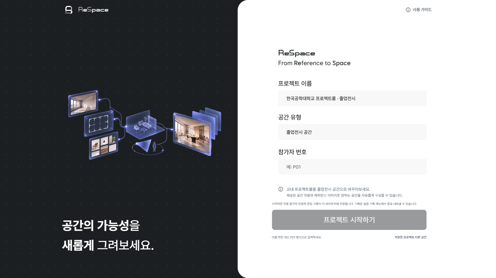
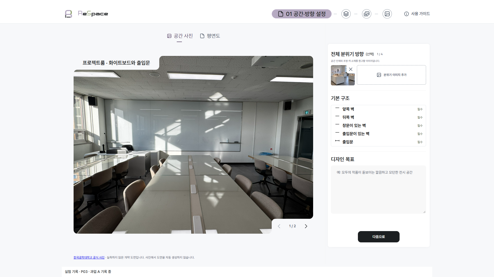
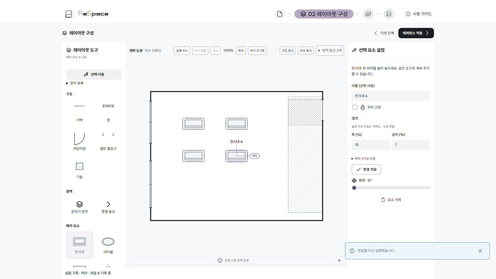
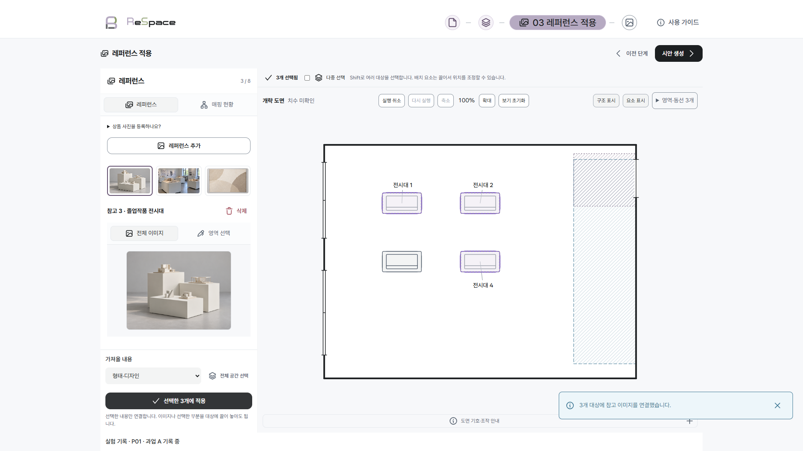
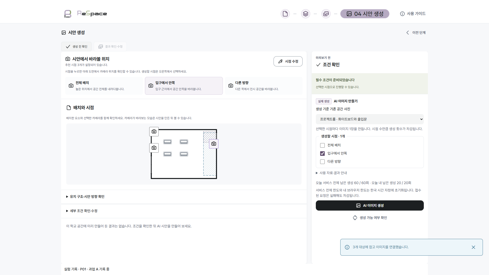

# ReSpace 사용 가이드

현재 서비스 기준 · 2026.10.08

ReSpace는 실제 공간에 전시대·가구·조명을 배치하고, 여러 참고 이미지의 필요한 디자인을 연결해 AI 공간 시안을 만드는 서비스입니다. 이 가이드는 한국공학대학교 프로젝트룸을 졸업전시 공간으로 꾸미는 기본 예시를 따라 설명합니다.

공간·방향 설정 → 레이아웃 구성 → 레퍼런스 적용 → 시안 생성. 상단 네 단계로 이동합니다. 로고는 홈으로, 홈의 ‘저장한 프로젝트·다른 공간’은 목록으로 연결됩니다.

익명 번호를 입력하고 시작합니다. 저장된 작업과 다른 공간은 오른쪽 아래 목록 버튼에서 엽니다.

| 단계 | 할 일 | 다음 단계로 가기 전 |
| --- | --- | --- |
| 01 공간·방향 설정 | 기존 공간 사진·도면·유지 구조 확인 | 어떤 공간을 꾸밀지, 무엇을 유지할지 확인 |
| 02 레이아웃 구성 | 구조·영역·가구와 조명 배치 | 요소가 어디에 놓이는지 도면에서 확인 |
| 03 레퍼런스 적용 | 이미지의 필요한 부분을 배치에 연결 | 어떤 디자인을 어느 대상에 가져올지 확인 |
| 04 시안 생성 | 시점·조건 확인, 생성과 부분 수정 | 결과를 사진·도면·지정 조건과 직접 대조 |

## 연습할 때

홈의 프로젝트 이름·공간 유형은 기본값이 들어 있는 수정 가능한 입력란입니다. 그대로 사용하거나 고칠 수 있습니다. 세 입력란이 모두 채워져야 시작할 수 있습니다. 진행자가 제공한 익명 번호(예: P01)를 입력하고 ‘프로젝트 시작하기’를 누르세요. 새 학교 프로젝트와 과업 A의 로컬 기록이 함께 준비됩니다. 학교 사진·개략 도면·참고 이미지는 제공되며 배치와 연결은 직접 정합니다. 시작 버튼 앞에서 기록 안내를 확인하세요.

## 내 공간으로 시작할 때

1. 홈의 ‘저장한 프로젝트·다른 공간’을 누릅니다. ‘새 프로젝트 만들기’에서 이름을 입력하고 ‘프로젝트 만들기’를 누릅니다.
2. 1단계에서 실제 공간 사진과 평면도를 각각 준비합니다. 도면이 없으면 개략 도면으로 시작합니다. 사진을 올려도 도면이 자동으로 만들어지지 않습니다.
3. 2단계에서 배치한 뒤 3단계에서 이미지를 연결합니다. 이 다른 공간 경로의 실험 기록은 진행자가 안내한 경우에만 별도로 시작합니다.

프로젝트는 현재 브라우저에 자동 저장됩니다. 같은 기기·브라우저에서 이어서 작업하고, 개인 정보가 포함된 이름·메모는 사용하지 마세요.

# 01 공간·방향 설정

실제 공간과 유지할 구조 확인

왼쪽 사진·평면도를 확인하고 오른쪽에 원하는 공간의 디자인 목표를 적습니다.

1. 학교 프로젝트의 ‘공간 사진’과 ‘평면도’를 전환해 제공된 공간을 확인합니다. 사진에서 벽이나 실측 도면을 자동 추출하지 않습니다.
2. 오른쪽 ‘전체 분위기 방향’에 공간 전체의 색·조명·소재 참고 이미지를 선택적으로 등록합니다. 최대 4장이며 전체 레퍼런스 8장 제한에 포함됩니다. 가구의 구체적인 연결은 3단계에서 합니다.
3. 기본 구조 5가지는 위치·형태를 바꿀 수 없는 필수 구조입니다. 같은 벽에 호환되는 장식이나 조명을 연결하는 것은 가능합니다.
4. ‘디자인 목표’에 원하는 공간을 적습니다. 입력한 내용은 저장되고 최종 생성 프롬프트 및 결과 당시 조건에 함께 반영됩니다. ‘다음으로’를 누르면 배치를 시작합니다.

사진은 실제 모습의 참고, 도면은 구조·배치·시점의 기준입니다. 사진이나 도면 이미지에서 벽·치수를 자동 추출하지 않습니다. 학교 예시 도면은 실측하지 않은 설명용 개략도입니다.

학교 참가자 프로젝트의 기본 구조는 보존 해제를 할 수 없습니다. 일반·과거 프로젝트의 보존 체크는 기존대로 편집할 수 있습니다. 다른 공간은 기존 사진·도면 업로드와 개략도/직접 윤곽 그리기를 이용합니다. 새 도면을 올릴 때 기존 표시의 새 시작·유지 여부를 확인하세요.

도면의 보라색 빗금은 출입 여유, 파란색 빗금은 통행 동선입니다. 도면 아래 ‘도면 기호·조작 안내’에서 나머지 기호를 확인할 수 있습니다.

# 02 레이아웃 구성

왼쪽 도구 → 가운데 도면 → 오른쪽 설정

가구와 조명을 먼저 놓습니다. 이름·크기·위치 고정·회전은 오른쪽에서 조정합니다.

1. 왼쪽 ‘레이아웃 도구’에서 구조·영역·배치 요소를 고릅니다. 전시대·테이블·의자는 도면의 빈 바닥을 눌러 놓고, 가벽은 시작점부터 끝점까지 끌어 그립니다.
2. 같은 도구로 여러 개를 추가할 수 있습니다. ‘선택·이동’ 또는 ‘그리기 마치기’로 추가를 끝냅니다. 요소를 선택해 몸체를 끌거나 회전 손잡이로 조정합니다.
3. 선택한 요소의 이름·크기·위치 고정은 오른쪽에서 수정합니다. 수치 입력 후에는 표시된 ‘변경 적용’ 또는 ‘변경 저장’을 누릅니다. 이름을 비우고 추가하면 자동으로 구분됩니다.

| 영역 도구 | 의미 |
| --- | --- |
| 분위기 영역 | 같은 조명·색·소재를 적용할 범위입니다. 가구가 들어가도 됩니다. |
| 통행 동선 | 사람이 이동하도록 비워 둘 공간입니다. 가벽·기둥·바닥 가구로 막을 수 없습니다. |

배치 요소는 최대 20개입니다. 구조·영역은 이 개수에 포함되지 않습니다. 선택·이동 상태에서 요소를 고른 뒤 Backspace로 삭제할 수 있습니다. 이 단축키는 2단계에서만 동작하며, 글 입력·그리기 중에는 요소를 지우지 않습니다.

# 03 레퍼런스 적용

이미지의 필요한 부분을 기존 배치에 연결

예시: 전시대 이미지의 일부를 전시대 1·2·4에 함께 연결했습니다. 적용 버튼은 왼쪽 패널 아래에 있습니다.

1. ‘레퍼런스 추가’로 이미지를 등록하고 목록에서 선택합니다. ‘전체 이미지’를 쓰거나 ‘영역 선택’ 후 이미지에서 필요한 부분을 끌어 고릅니다. 진열할 상품 자체의 사진일 때만 ‘상품 사진을 등록하나요?’를 펼쳐 선택합니다.
2. 도면의 요소·벽·분위기 영역을 클릭해 적용할 대상을 고릅니다. 여러 대상은 Shift+클릭 또는 ‘다중 선택’으로 고릅니다. 방 전체 분위기에는 ‘전체 공간 선택’을 사용합니다.
3. 왼쪽 패널 아래 ‘가져올 내용’에서 형태·디자인, 조명 분위기, 색·소재를 고른 뒤 ‘선택한 n개에 적용’을 누릅니다. 이미지를 바꿨을 때도 가져올 내용을 다시 확인하세요.

레퍼런스는 컨셉·가구·제품을 합해 최대 8장입니다. 같은 이미지를 여러 요소에 연결해도 1장으로 셉니다. 기존 공간 사진·평면도·생성 결과는 이 제한에서 제외됩니다. 참고 사진의 방 전체를 복제하지 않고 선택한 대상의 디자인을 연결합니다.

이미지나 선택 영역을 도면 대상으로 끌어 놓는 방법도 있습니다. 드래그는 선택 사항입니다. 선택 영역을 다시 그릴 때는 영역 바깥에서 끌거나 Shift를 누르고 끕니다.

‘매핑 현황’에서 연결을 확인합니다. ‘변경’은 같은 탭에서 가져올 내용만 바꾸고, ‘연결 해제’는 배치를 남깁니다. 다른 이미지로 바꾸려면 ‘레퍼런스’ 탭에서 새 이미지를 선택해 다시 적용하세요.

# 04 시안 생성

추천 시점과 조건을 확인한 뒤 생성

위 시점 카드는 도면의 카메라를 확인하는 용도입니다. 실제 생성할 시점은 오른쪽 체크 목록에서 선택합니다.

1. ‘생성 전 확인’에서 배치와 ‘시안에서 바라볼 위치’를 확인합니다. 보통 추천 시점 3개가 준비됩니다. 직접 카메라를 만들 필요는 없으며, 바꾸고 싶을 때만 ‘시점 수정’을 누릅니다.
2. 오른쪽에서 ‘생성 기준 기존 공간 사진’과 생성할 시점을 고릅니다. 사진이 여러 장이면 구조가 잘 보이는 사진을 선택하세요. 오류가 있으면 해당 ‘수정하기’로 돌아가 필요한 부분만 고칩니다.
3. 필수 조건과 서버 상태가 준비되면 ‘AI 이미지 생성’을 누릅니다. 선택한 시점마다 이미지 1장을 만들며, 장수만큼 생성 횟수가 차감됩니다.

| 추천 시점 | 보려는 모습 |
| --- | --- |
| 전체 배치 | 높은 위치에서 공간 전체의 배치와 동선을 봅니다. |
| 입구에서 안쪽 | 입구 근처에서 공간 안쪽을 봅니다. |
| 다른 방향 | 다른 위치·방향에서 전시 공간을 봅니다. |

추천은 개략 도면을 이용한 제안입니다. 놓을 공간이 부족하면 3개보다 적을 수 있습니다. 위치·방향은 ‘시점 수정’에서 확인하세요. 편집 화면의 ‘이전 단계’를 누르면 4단계 ‘생성 전 확인’으로 돌아갑니다. 다른 1~3단계에는 카메라가 표시되지 않습니다.

# 결과 확인과 부분 수정

04 시안 생성 안에서 계속 작업

이미지가 저장되면 ‘결과 확인·수정’이 활성화됩니다. 왼쪽의 큰 이미지·결과 이력·작은 시점 도면과 오른쪽의 당시 조건을 함께 확인하세요. 결과가 없으면 이 탭은 비활성입니다.

| 바꾸고 싶은 것 | 결과 화면에서 누를 버튼 |
| --- | --- |
| 가구·조명의 위치나 크기 | 레이아웃 수정 |
| 가져온 디자인이나 이미지 | 레퍼런스 수정 |
| 카메라 위치·방향 | 시점 수정 |

1. 실제 공간 사진과 도면을 기준으로 벽·창·출입구, 가구 위치, 그래픽과 조명 조건이 반영됐는지 직접 대조합니다.
2. 수정 버튼으로 해당 단계에 돌아가 필요한 조건만 바꿉니다. 앞 단계로 돌아가도 다른 선택은 유지됩니다. ‘생성 전 확인’에서 바뀐 조건을 보고 다시 생성합니다.
3. 조건을 바꾸면 이전 이미지에 ‘이전 조건’ 표시가 붙습니다. 이미지는 이력에 보관됩니다. 검토한 결과는 ‘이 결과 승인’으로 표시하고 ‘이미지 내보내기’로 받을 수 있습니다.

AI 이미지는 정확한 시공·치수·구조 일치를 보장하지 않습니다. ‘사전 제공 샘플’은 현재 조건으로 생성한 이미지가 아닙니다. 학교 졸업전시 예시에는 학교 공간에 대응하는 사전 제공 결과가 없어 실제 이미지 생성이 필요합니다.

## 생성 횟수와 대기

현재 한도는 서비스 전체 하루 60회, 같은 익명 브라우저 하루 20회입니다. 한국 시간 자정에 갱신되며, 접수된 요청은 실패해도 차감됩니다. ‘생성 가능 여부 확인’은 서버 상태와 남은 횟수를 새로 확인합니다. 이미지 생성 버튼을 대신하지 않습니다.

여러 시점 중 일부가 실패해도 먼저 완성된 이미지는 유지됩니다. 요청 결과가 불확실하다는 안내가 나오면 반복 클릭하지 말고 화면의 대기·확인 절차를 따르세요. ‘작업 기록 JSON’에는 원본 사진과 결과 이미지 파일이 포함되지 않으므로 필요한 이미지는 별도로 받습니다.

# 실험 기록 종료와 제출

홈 시작은 과업 A를 자동 기록

홈에서 참가자 번호로 시작하면 과업 A의 기록이 이미 시작되어 있습니다. 하단 ‘실험 기록’에서 상태를 확인하고 종료·설문·ZIP 받기를 진행합니다. 저장한 프로젝트·다른 공간 경로에서 별도로 기록할 때만 수동 설정을 사용합니다.

## 과업 A·B는 무엇인가요?

A·B는 진행자가 구분하는 과업 자료 묶음의 이름입니다. 학교 졸업전시·브랜드 팝업을 자동으로 바꾸는 버튼이 아닙니다. 선택만으로 사진·도면·기능은 바뀌지 않고 기록에 과업 이름만 붙습니다. 현재 앱은 두 과업 모두 같은 인터페이스 방식으로 기록합니다.

1. 진행자에게 익명 번호, 사용할 자료, 종료 기준을 받습니다. 이름·학번 대신 P01 형식으로 입력합니다.
2. 홈에서 번호를 입력하고 프로젝트를 시작합니다. 과업 A와 로컬 편집 기록이 자동 준비되므로 ‘이 프로젝트 기록 시작’을 다시 누를 필요가 없습니다.
3. 같은 기기·브라우저의 한 탭에서 과업을 수행하고 사이트 데이터를 삭제하지 않습니다. 다른 참가자는 현재 기록을 종료한 뒤 시작합니다.
4. 종료 기준에 도달하면 이 프로젝트의 하단 ‘실험 기록’에서 ‘과업 종료’를 누릅니다. 이때 최종 조건이 고정됩니다.
5. 과업 직후 설문 6개에 응답하고 ‘실험 기록 ZIP 받기’를 누릅니다. 참여 번호·과업을 확인해 진행자에게 직접 전달합니다.

## 제출과 수정

설문을 바꿨다면 ZIP을 다시 받으세요. 과업 종료 후 프로젝트를 수정해도 이미 종료한 기록의 최종 조건은 바뀌지 않습니다. 다음 과업은 별도 기록으로 시작합니다.

ZIP에는 행동 기록·시작 및 최종 조건·설문·계산 지표와 평가 양식이 들어갑니다. 원본 사진·도면·결과 이미지 파일은 들어가지 않습니다. 서버 자동 제출은 제공하지 않으며, 실제 시안 이미지의 제출 여부는 진행자에게 확인하세요.

# 막혔을 때와 조작 도움말

자주 묻는 질문

| 상황 | 확인할 것 |
| --- | --- |
| 요소는 있는데 도면에 안 보임 | ‘요소 표시’가 켜져 있는지 확인하고 ‘배치 목록’에서 선택합니다. 위치 미지정·위치 확인 필요라면 연결한 위치를 다시 지정합니다. 이름은 선택·마우스 올림 때 보입니다. |
| 영역이 많아 복잡함 | ‘영역·동선’에서 종류별 표시를 조정합니다. ‘도면 기호·조작 안내’에서 점선·빗금의 뜻을 확인합니다. 메뉴는 X·Escape·바깥 클릭으로 닫습니다. |
| 이동·추가가 거절됨 | 통행 동선, 문 열림 여유, 기둥·가구 충돌과 위치 고정을 확인합니다. 거절된 위치는 저장되지 않아 기존 위치가 남습니다. |
| 기본 구조를 움직일 수 없음 | 새 학교 참가자 프로젝트의 기본 구조는 필수 보존되어 위치·형태를 수정할 수 없습니다. 호환되는 장식·조명은 붙일 수 있습니다. 과거·일반 프로젝트는 보존 체크와 연결된 구조의 잠금을 확인합니다. |
| 가벽에 그래픽을 붙이고 싶음 | 벽면 연출을 배치하거나 3단계에서 가벽에 이미지를 연결합니다. 도면의 A/B 표시를 눌러 붙일 면을 고릅니다. 패널의 선택도 함께 바뀌며 기존 적용 버튼으로 저장합니다. 반대 면에서 보이지 않도록 전달하는 조건이며 결과는 직접 확인합니다. |
| 조명·상품은 어디에 놓나요? | 조명의 기본값은 바닥에 세우는 스탠드 조명입니다. 오른쪽에서 벽·천장 설치로 바꿀 수 있습니다. 천장 조명은 바닥 가구 위에 놓을 수 있지만 다른 천장 조명과 같은 위치에는 놓을 수 없습니다. 진열 상품은 도면의 전시대·테이블을 누르거나 오른쪽 목록에서 받침을 고릅니다. 상품과 받침의 겹침은 허용됩니다. |
| 사진이 많은데 어떤 사진으로 생성하나요? | 4단계 오른쪽 ‘생성 기준 기존 공간 사진’에서 고릅니다. 사진의 이동식 가구와 내가 만든 배치를 구분하고, 유지할 구조는 도면에서도 확인합니다. |
| 생성 버튼이 비활성임 | 오른쪽 ‘조건 확인’에서 첫 오류를 수정합니다. 레퍼런스 연결, 배치, 시점과 자료 준비를 확인하고 서버 상태·잔여 횟수도 봅니다. |
| 레퍼런스나 요소를 실수로 삭제함 | 캔버스에서 Ctrl+Z로 실행 취소합니다. Ctrl+Shift+Z는 다시 실행입니다. 알림이 사라져도 되돌리기 기록은 남습니다. 텍스트 입력 중에는 글 편집 단축키가 동작합니다. |
| 브라우저 저장 오류가 뜸 | 탭을 닫기 전에 필요한 이미지·작업 기록·실험 ZIP을 먼저 받으세요. 화면의 저장 재시도를 이용하고 사이트 데이터를 임의로 지우지 마세요. |

모든 일시 알림은 2초 뒤 사라지며 X로 즉시 닫을 수 있습니다. 알림이 닫혀도 실제 조건 문제와 저장·되돌리기 상태는 유지됩니다. 삭제 확인은 직접 선택하거나 X로 취소합니다.

상단 네 단계와 브라우저 뒤로·앞으로로 이동할 수 있습니다. Tab으로 현재 조작 위치를 확인합니다. 이 안내는 2026-10-08 구현 및 실제 Chrome 검증 기준입니다. 캡처는 사용 설명용이며 실제 AI 결과나 평가 결과가 아닙니다.
